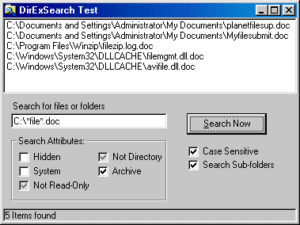

<div align="center">

## Super Fast File Search Class \- RealTime file return, Recursive, CaseSensitive, & Attribute Filter


</div>

### Description

I call this file search class cDirEx. Other file search examples on this site are pretty nice, but I wanted one that would return each file immediately after a successful match. So I came up with what I call, real-time file return. This search class lets you control the files searched by specifying certain file attributes to search or ignore. Recursive and Case Sensitive searches are supported as well.
 
### More Info
 
Byval Pathname As String, Optional ByVal Attributes As VbFileAttribute, Optional ByVal NotAttributes As VbFileAttribute

Add the following line of code to the General Declorations of a module implementing the class.

' Private WithEvents DirEx As cDirEx

files matching filespec and attributes are returned


<span>             |<span>
---                |---
**Submitted On**   |2001-06-11 00:06:48
**By**             |[Greg Miller](https://github.com/Planet-Source-Code/PSCIndex/blob/master/ByAuthor/greg-miller.md)
**Level**          |Intermediate
**User Rating**    |4.9 (39 globes from 8 users)
**Compatibility**  |VB 4\.0 \(32\-bit\), VB 5\.0, VB 6\.0
**Category**       |[Files/ File Controls/ Input/ Output](https://github.com/Planet-Source-Code/PSCIndex/blob/master/ByCategory/files-file-controls-input-output__1-3.md)
**World**          |[Visual Basic](https://github.com/Planet-Source-Code/PSCIndex/blob/master/ByWorld/visual-basic.md)
**Archive File**   |[Super Fast209806112001\.zip](https://github.com/Planet-Source-Code/greg-miller-super-fast-file-search-class-realtime-file-return-recursive-casesensitive-attr__1-23976/archive/master.zip)

### API Declarations

```
Option Explicit
' Result Flags to sent to the Result event at end of file search
Public Enum DirExResultFlags
 DirExSuccess = 0
 UserCanceled = 1120
 PathNameNotValid = 1121
 FileSpecNotFound = 1122
 DirExFailed = 1123
End Enum
' Event raised for every folder searched
Public Event CurrentFolder(ByVal FolderPath As String)
' Event raised with each file found
Public Event CurrentFile(ByVal FolderPath As String, ByVal FileName As String, FileAttribute As VbFileAttribute)
' Event raised when all searching is finished
Public Event Finished(ByVal FileCount As Integer, Result As DirExResultFlags)
' Attributes
Private Enum FileAttributes
 FILE_ATTRIBUTE_READONLY = &H1
 FILE_ATTRIBUTE_HIDDEN = &H2
 FILE_ATTRIBUTE_SYSTEM = &H4
 FILE_ATTRIBUTE_DIRECTORY = &H10
 FILE_ATTRIBUTE_ARCHIVE = &H20
 FILE_ATTRIBUTE_DEVICE = &H40
 FILE_ATTRIBUTE_NORMAL = &H80
 FILE_ATTRIBUTE_TEMPORARY = &H100
 FILE_ATTRIBUTE_SPARSE_FILE = &H200
 FILE_ATTRIBUTE_REPARSE_POINT = &H400
 FILE_ATTRIBUTE_COMPRESSED = &H800
 FILE_ATTRIBUTE_OFFLINE = &H1000
 FILE_ATTRIBUTE_NOT_CONTENT_INDEXED = &H2000
 FILE_ATTRIBUTE_ENCRYPTED = &H4000
End Enum
' variables:
Private hFile As Long
Private hItem As Long
Private m_Files As Integer
Private m_FileSpec As String
Private m_Recurse As Boolean
Private m_CaseSensitive As Boolean
Private m_Attributes As FileAttributes
Private m_NotAttributes As FileAttributes
Private m_ResultFlag As DirExResultFlags
Private Const INVALID_HANDLE_VALUE = -1
Private Type WIN32_FIND_DATA
  dwFileAttributes As Long
  ftCreationTime As Currency
  ftLastAccessTime As Currency
  ftLastWriteTime As Currency
  nFileSizeHigh As Long
  nFileSizeLow As Long
  dwReserved0 As Long
  dwReserved1 As Long
  cFileName As String * 260
  cShortFileName As String * 14
End Type
Private WFD As WIN32_FIND_DATA
Private Declare Function FindFirstFile Lib "kernel32" Alias "FindFirstFileA" ( _
 ByVal lpFileName As String, lpFindFileData As WIN32_FIND_DATA) As Long
Private Declare Function FindNextFile Lib "kernel32" Alias "FindNextFileA" ( _
 ByVal hFindFile As Long, lpFindFileData As WIN32_FIND_DATA) As Long
Private Declare Function FindClose Lib "kernel32" (ByVal hFindFile As Long) As Long
Private Declare Function GetFileAttributes Lib "kernel32" Alias "GetFileAttributesA" ( _
 ByVal lpFileName As String) As Long
Private Declare Function GetFullPathName Lib "kernel32" Alias "GetFullPathNameA" (ByVal lpFileName As String, ByVal nBufferLength As Long, ByVal lpBuffer As String, ByVal lpFilePart As Long) As Long
```


